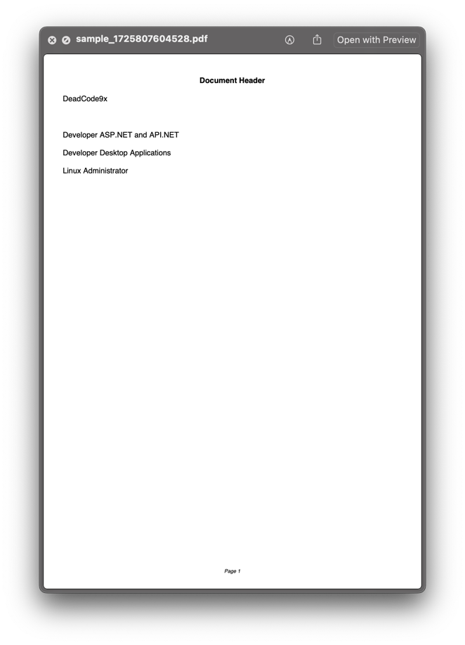

---

# Clipboard Manager App


A feature-rich clipboard management application that captures, views, and exports clipboard content as PDFs. Built with Python's Tkinter for the user interface and FPDF for PDF generation, this app provides a seamless experience for managing clipboard data.

[](https://www.python.org/)
[](https://www.linkedin.com/in/kareem-mohamed-b7643a319)
## Features

- **Clipboard Monitoring:** Real-time tracking of clipboard changes.
- **Save to PDF:** Export clipboard content, including images, to PDF.
- **Clear List:** Remove all items from the list with a single click.
- **Copy to Clipboard:** Easily copy selected items from the list back to your clipboard.

## Installation

### Prerequisites

Ensure you have Python 3.6 or later installed. You can download it from [Python's official website](https://www.python.org/downloads/).

### Clone the Repository

```bash
git clone https://github.com/D7x00/clipboardmanager.git
cd clipboardmanager
```

### Install Dependencies

```bash
pip install pillow pyperclip fpdf
```

## Usage

### Running the Application

```bash
python main.py
```

### Application Overview

- **Monitoring:** Automatically tracks and displays clipboard content.
- **Save to PDF:** Click the save icon to generate a PDF of the clipboard content.
- **Clear List:** Use the clear icon to empty the listbox.
- **Copy to Clipboard:** Use the clipboard icon to copy the selected listbox item.

## Configuration

Customize the application's behavior and appearance by modifying the `config.json` file located in the `./asset/` directory.

### Example Configuration (`config.json`)

```json
{
    "logo": {
        "text": "DeadCode9x",
        "font": "Brush Script MT",
        "size": 90,
        "color": "FireBrick"
    },
    "pdf_settings": {
        "page_format": "A4",
        "font": "Arial",
        "font_size": 12,
        "margin": 10
    },
    "header": {
        "text": "Document Header",
        "font": "Arial",
        "style": "B",
        "size": 12,
        "align": "C"
    }
}
```

## Screenshots

### Application Interface


### Generated PDF




## Contact

For any questions or support, please reach out via [email](mailto:kareemahmedmohamed370@gmail.com) or open an issue on GitHub.

---
